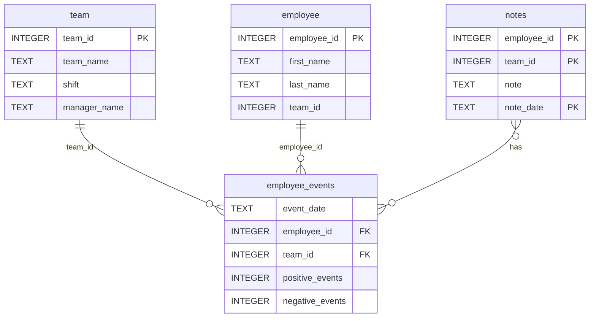

# Software Engineering for Data Scientists - Final Project
This repository contains the completed final project for the Software Engineering for Data Scientists Nanodegree program. It features an interactive, production-ready analytics dashboard built using FastHTML and powered by live Machine Learning model inference. The architecture is decoupled into a modular, installable Python database API package and a web frontend.

📁 Repository Structure
Plaintext
├── README.md                 # Project documentation
├── requirements.txt          # Global project dependencies (including local package)
├── assets/                   # Static assets for styling and core models
│   ├── model.pkl             # Trained Scikit-Learn pipeline
│   └── report.css            # Dashboard styling rules
├── .github/workflows/        # Automated CI/CD pipelines
│   └── tests.yml             # Automated Pytest suite configuration
├── python-package/           # Distribution & Build directory
│   ├── setup.py              # Setuptools build configuration
│   ├── dist/                 # Required production .tar.gz builds
│   └── employee_events/      # Core Python Package source directory
│       ├── __init__.py       # Package initialization & exports
│       ├── query_base.py     # Abstract base queries
│       ├── sql_execution.py  # SQL execution engine
│       ├── employee.py       # Employee data query models
│       ├── team.py           # Team data query models
│       ├── employee_events.db# Production SQLite Database
│       └── requirements.txt  # Core package dependencies
├── report/                   # Dashboard Frontend Web Application
│   ├── dashboard.py          # Main FastHTML Application
│   ├── utils.py              # ML Inference and utility tools
│   ├── base_components/      # UI Atoms (dropdowns, tables, etc.)
│   └── combined_components/  # UI Molecules (form groups)
└── tests/                    # Unit testing suite
    └── test_employee_events.py

# 📊  Database Schema (employee_events.db)
The custom Python package queries a structured SQLite database containing factory operational logs. The relationship mapping is defined as follows:



🚀 Setup and Installation
Follow these steps to reproduce the full development environment and run the application locally.

1. Clone the Repository
```Bash
git clone <your-github-repo-url>
cd dsnd-dashboard-project
```

2. Configure the Virtual Environment
Create and activate a clean Python 3.10+ virtual environment:

```Bash
python -m venv env
source env/bin/activate  # On Windows use: env\Scripts\activate
```
3. Build & Install the Custom Python Package
The database query infrastructure must be built and installed as a package dependency. This automatically generates the required source distribution archive inside python-package/dist/ required by the project rubric:


### Navigate to the package setup and build the distribution
```
cd python-package
python setup.py sdist
```
### Return to root
```
cd ..
```

4. Install Project Dependencies
Install all required libraries along with the local package via the main configuration file:

```Bash
pip install -r requirements.txt
```
🧪 Verification & Testing
Automated Local Tests
To verify the database structure and validate that all tables exist and read operations function correctly, execute pytest from the root directory:

```Bash
pytest -s
```
Continuous Integration (CI)
A automated continuous integration workflow is established via GitHub Actions. Any commit pushed to the main branch automatically triggers the test suite on an isolated Linux runner to guarantee code stability.

💻 Running the Dashboard
Start the live FastHTML application server locally:

```Bash
python report/dashboard.py
```
Once initialized, open your preferred web browser and navigate to the application endpoint:
👉 http://localhost:5000

Core Features
Decoupled Architecture: Clean separation between the database access layer (employee_events) and the presentation layer (FastHTML).

Interactive Filtering: Slices live relational data by teams, managers, and operational shifts.

ML Inference Pipeline: Implements a Scikit-Learn predictor to assess recruitment and retention risk metrics dynamically.